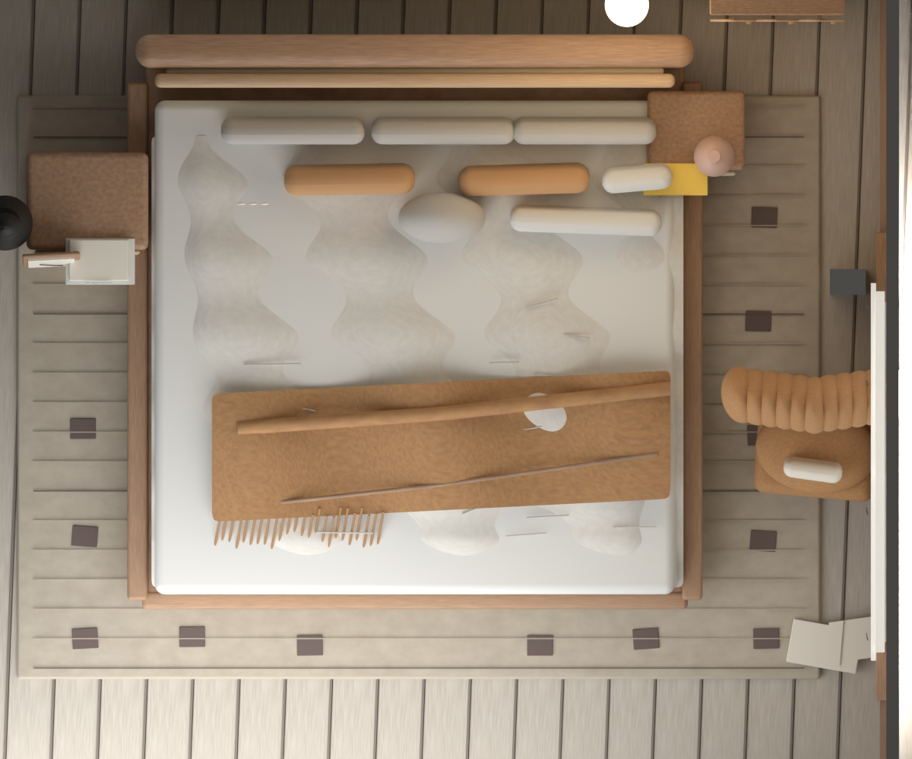

# Codex Blender Reference Rebuild Skill

`blender-reference-rebuild` is a Codex skill for rebuilding indoor reference images as editable Blender scenes.

It is designed for Blender MCP or local Blender Python workflows where the final camera render must match the reference image. The skill emphasizes:

- Screen-space contracts before modeling.
- World-space constraints after composition is close.
- Blocking geometry preflight.
- Same-view camera renders that match the reference.
- Editable `.blend` scene delivery.

## Install

Clone the repository:

```bash
git clone https://github.com/tflsguoyu/codex-blender-reference-rebuild-skill.git
cd codex-blender-reference-rebuild-skill
```

Install into Codex:

```bash
bash tools/install.sh
```

Or copy manually:

```bash
mkdir -p "${CODEX_HOME:-$HOME/.codex}/skills"
cp -R skills/blender-reference-rebuild "${CODEX_HOME:-$HOME/.codex}/skills/"
```

## Prepare Your Environment

Before using the skill, make sure you have:

1. Codex installed and able to load local skills from `${CODEX_HOME:-$HOME/.codex}/skills`.
2. Blender installed locally.
3. Blender open when you want Codex to create or inspect a scene.
4. A working Blender control path:
   - Blender MCP / Blender Lab MCP, recommended for interactive scene control.
   - Or another local Blender Python execution workflow that Codex can use.
5. An indoor reference image ready to provide to Codex.

This skill does not install Blender or Blender MCP for you. It teaches Codex the reconstruction workflow once Blender access is already available.

## Use

In Codex, ask:

```text
Use $blender-reference-rebuild to reconstruct this indoor reference image in Blender.
```

The skill expects Blender to be available locally. For interactive scene creation, use it with Blender MCP or an equivalent local Blender Python execution path.

Default public output should be simple:

- An editable `.blend` file.
- A same-view camera render matching the reference image.

## Example: Cozy Bedroom

This repository includes a small cozy bedroom example.

Reference input:


Same-view reconstruction render:


Optional top-down debug view:



Use the example like this:

```text
Use $blender-reference-rebuild to reconstruct examples/cozy-bedroom/reference.jpg as an editable Blender scene.

Use Blender MCP or local Blender Python. Match the final camera render to the reference image. Save only:
1. examples/cozy-bedroom/output/scene.blend
2. examples/cozy-bedroom/output/camera-render.png
```

Expected output:

```text
examples/cozy-bedroom/output/
  scene.blend
  camera-render.png
```

`topdown-render.png`, validation reports, perceptual heatmaps, and iteration archives are useful for local debugging, but they are not required for normal public use.

## Repository Layout

```text
skills/blender-reference-rebuild/
  SKILL.md
  agents/openai.yaml
  references/rebuild-method.md
  scripts/init_rebuild_workspace.py
  scripts/validate_rebuild_report.py
  assets/contracts/scene_contract.template.json
  assets/reports/validation_report.template.json
examples/cozy-bedroom/
  reference.jpg
  camera-render.png
  topdown-render.png
tools/install.sh
tools/validate_skill.py
```

## Helper Scripts

Optional local debugging: create a standard reconstruction workspace with contract/report folders:

```bash
python3 skills/blender-reference-rebuild/scripts/init_rebuild_workspace.py ./my-bedroom-rebuild
```

Optional local debugging: validate a layered report:

```bash
python3 skills/blender-reference-rebuild/scripts/validate_rebuild_report.py ./my-bedroom-rebuild/LATEST_RESULTS/validation_report.json
```

Validate the skill repository:

```bash
python3 tools/validate_skill.py skills/blender-reference-rebuild
```

## License

MIT
